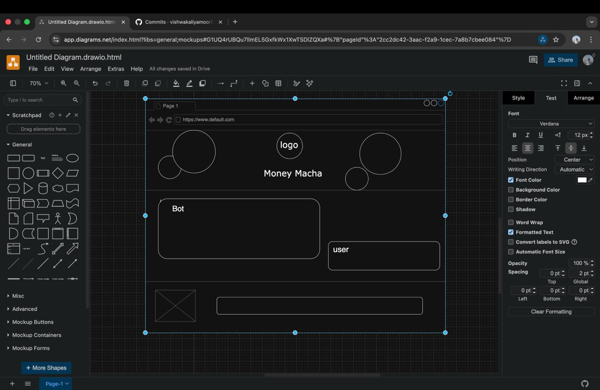
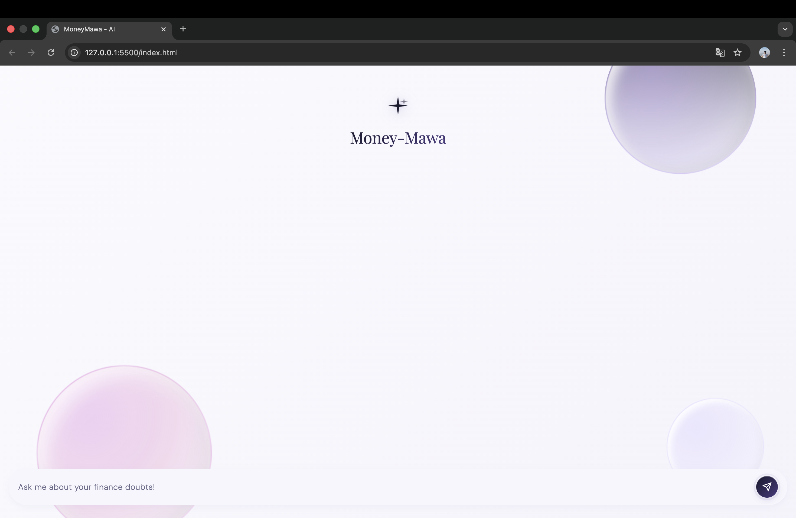

# Money Macha 

A Retrieval-Augmented Generation (RAG) based conversational assistant that answers financial questions using information from financial books and research reports.

---

## Live Demo

Try the assistant here

https://huggingface.co/spaces/yuva-2211/MoneyMacha

---

## Overview

This project demonstrates how to build a **context-aware financial assistant** that retrieves knowledge from financial documents and generates grounded answers using a large language model.

Instead of relying only on LLM training data, the assistant:

1. Retrieves relevant document chunks
2. Uses those chunks as context
3. Generates an answer grounded in the retrieved material

---

## Architecture

User Question
↓
Retriever (Pinecone Vector DB)
↓
Relevant Financial Documents
↓
LLM (Llama 3.1 via Groq)
↓
Generated Answer

---

## Tech Stack

* LangChain
* Pinecone Vector Database
* HuggingFace Embeddings (BAAI/bge-small-en-v1.5)
* Groq (Llama 3.1)
* Python
* Hugging Face Spaces (deployment)

---

## Features

* Conversational financial assistant
* Retrieval-Augmented Generation (RAG)
* Multi-turn conversation memory
* Context-grounded responses
* Prompt engineering to reduce hallucinations

---

## Documents Indexed

* The Psychology of Money
* Let's Talk Money
* Let's Talk Mutual Funds
* Financial literacy books
* Research reports

---
## WireFrames 

Initial interface planning and layout were designed using draw.io before implementation.
These wireframes helped define the conversational layout, message flow, and UI structure.

Chat Interface Wireframe




---
## User Interface
#### Desktop View

The desktop interface provides a full conversational layout optimized for larger screens, allowing users to interact with the financial assistant and view responses clearly.




#### Mobile View

The mobile interface is optimized for smaller screens while maintaining a smooth conversational experience.


---
## UI Design Process

The interface was designed with a focus on simplicity and usability:

Conversational chat layout

Clear question and response separation

Minimal distractions

Responsive design for desktop and mobile devices

Wireframes were first created in draw.io, then implemented in the final application.

---
## Installation

Clone the repository

```bash
git clone git@github.com:Yuva-2211/MoneyMacha.git
cd financial-rag-assistant
```

Install dependencies

```bash
pip install -r requirements.txt
```

Create a `.env` file

```
PINECONE_API_KEY=your_api_key
PINECONE_INDEX=your_index
GROQ_API_KEY=your_key
```

Run the project

```bash
python main.py
```

---

## Deployment

The project is deployed on **Hugging Face Spaces**

Live App
[MoneyMacha](https://huggingface.co/spaces/yuva-2211/MoneyMacha)

---
